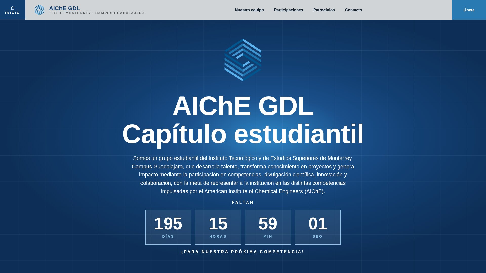
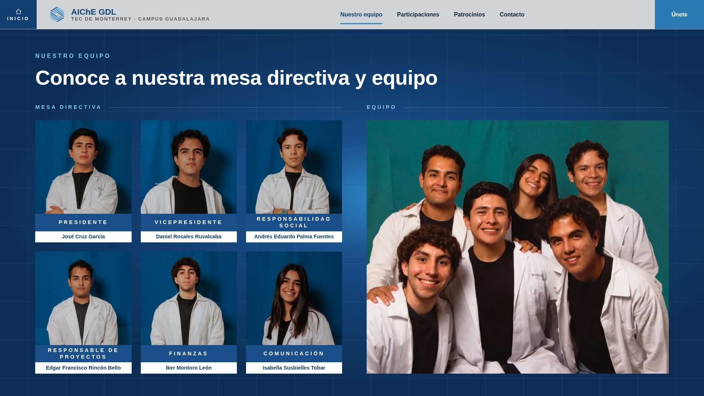
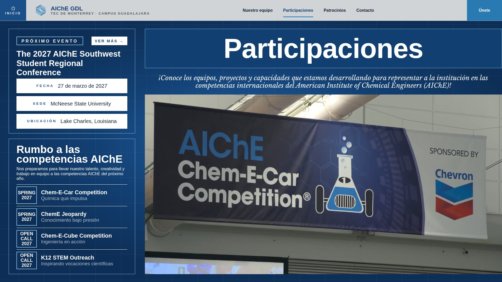
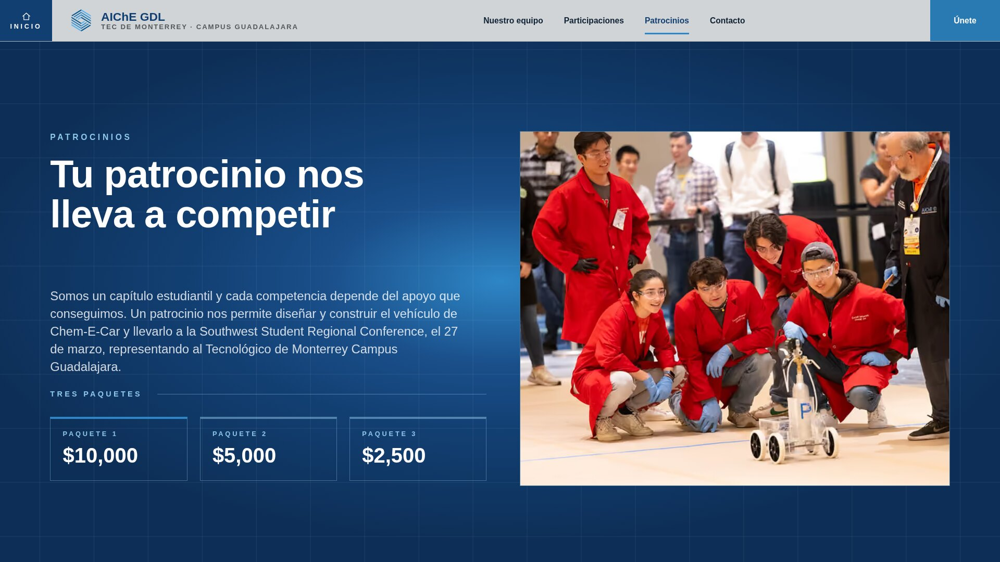
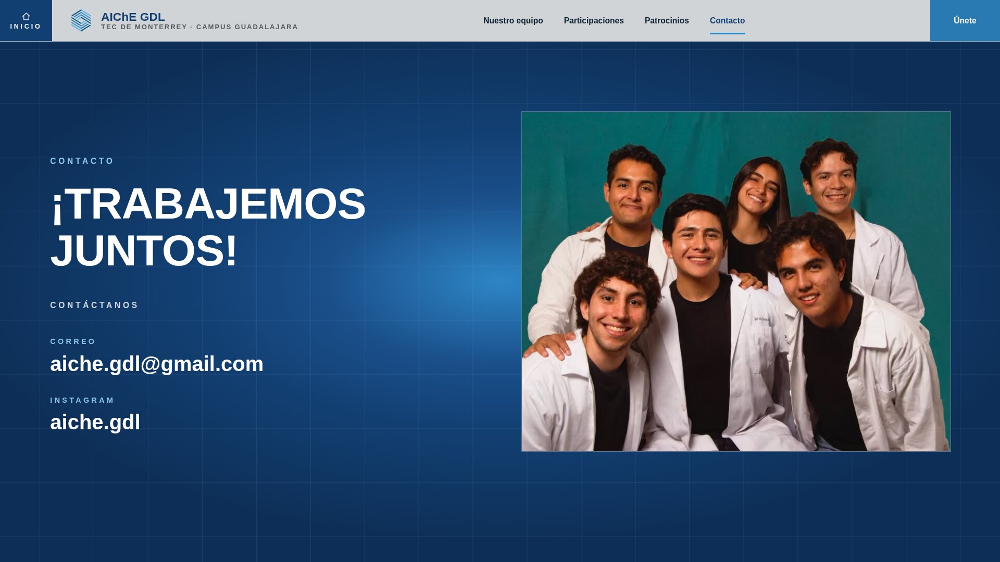

# AIChE GDL — Capítulo Estudiantil

**American Institute of Chemical Engineers · Tecnológico de Monterrey, Campus Guadalajara**

Somos un grupo estudiantil del Instituto Tecnológico y de Estudios Superiores de
Monterrey, Campus Guadalajara, que desarrolla talento, transforma conocimiento en
proyectos y genera impacto mediante la participación en competencias, divulgación
científica, innovación y colaboración, con la meta de representar a la institución
en las distintas competencias impulsadas por el American Institute of Chemical
Engineers (AIChE).

🌐 **[aiche-web.vercel.app](https://aiche-web.vercel.app)**

---

## Acerca de nosotros

> *¿Qué puede lograr una comunidad con el deseo de crear algo significativo?*

En la comunidad de AIChE GDL, creemos firmemente que la ingeniería también se
construye fuera del aula: al compartir ideas, enfrentar desafíos y aprender unos de
otros. Aunque nuestro origen está en la Ingeniería Química, colaboramos en un
espacio interdisciplinario que involucra estudiantes de distintas carreras STEM,
donde cada integrante puede descubrir sus capacidades únicas, aportar desde su
perspectiva y crecer junto a personas que comparten el deseo de crear algo
significativo. Más allá de formar equipos para concursos, buscamos construir una
comunidad capaz de aprender de cada experiencia, ampliar sus horizontes e imaginar
nuevas posibilidades, con el objetivo de avanzar con conocimiento, colaboración y
visión hacia el futuro.

**Más de 200 estudiantes** de distintas carreras y niveles educativos han
participado en el proyecto.

---

## Próximo evento

### The 2027 AIChE Southwest Student Regional Conference

| | |
|---|---|
| **Fecha** | 27 de marzo de 2027 |
| **Sede** | McNeese State University |
| **Ubicación** | Lake Charles, Louisiana |

La Regional South West de Chem-E-Car es una competencia organizada por AIChE donde
equipos universitarios del suroeste de Estados Unidos y México diseñan y construyen
un vehículo a pequeña escala impulsado y detenido mediante reacciones químicas. El
objetivo es recorrer con precisión una distancia anunciada el mismo día de la
competencia, demostrando innovación, seguridad y aplicación práctica de la
ingeniería química. Funciona como clasificatoria para la competencia nacional.

---

## Rumbo a las competencias AIChE

Nos preparamos para llevar nuestro talento, creatividad y trabajo en equipo a las
competencias AIChE del próximo año.

| Competencia | | |
|---|---|---|
| **Chem-E-Car Competition** | Química que impulsa | Spring 2027 |
| **ChemE Jeopardy** | Conocimiento bajo presión | Spring 2027 |
| **Chem-E-Cube Competition** | Ingeniería en acción | Open call 2027 |
| **K12 STEM Outreach** | Inspirando vocaciones científicas | Open call 2027 |

---

## Tu patrocinio nos lleva a competir

Somos un capítulo estudiantil y cada competencia depende del apoyo que conseguimos.
Un patrocinio nos permite diseñar y construir el vehículo de Chem-E-Car y llevarlo
a la Southwest Student Regional Conference, el 27 de marzo, representando al
Tecnológico de Monterrey Campus Guadalajara.

### Paquete 1 — $10,000

- Mención especial redes sociales de la Federación de Estudiantes (FETEC).
- Logo/banner en coche y uniforme del equipo.
- Certificado de reconocimiento.
- Post de agradecimiento en redes sociales oficiales del equipo.
- Espacio para hablar sobre su empresa a alumnos de ingeniería química del
  Tecnológico de Monterrey Campus GDL.
- Posibilidad de facturación.

### Paquete 2 — $5,000

- Logo/banner en uniformes del equipo.
- Certificado de reconocimiento.
- Post de agradecimiento en redes sociales oficiales del equipo.
- Posibilidad de facturación.

### Paquete 3 — $2,500

- Post de agradecimiento en redes sociales oficiales del equipo.
- Certificado de reconocimiento.
- Posibilidad de facturación.

---

## Nuestro equipo

| Mesa directiva | |
|---|---|
| Presidente | José Cruz García |
| Vicepresidente | Daniel Rosales Ruvalcaba |
| Responsabilidad social | Andrés Eduardo Palma Fuentes |
| Responsable de proyectos | Edgar Francisco Rincón Bello |
| Finanzas | Iker Montoro León |
| Comunicación | Isabella Susbielles Tobar |

---

## El sitio

<table>
  <tr>
    <td width="50%"></td>
    <td width="50%"></td>
  </tr>
  <tr>
    <td align="center"><b>Nuestro equipo</b> · mesa directiva y equipo</td>
    <td align="center"><b>Participaciones</b> · próximo evento y competencias</td>
  </tr>
  <tr>
    <td width="50%"></td>
    <td width="50%"></td>
  </tr>
  <tr>
    <td align="center"><b>Patrocinios</b> · los tres paquetes</td>
    <td align="center"><b>Contacto</b> · correo e Instagram</td>
  </tr>
</table>

---

## ¡Súmate al capítulo!

**El siguiente reto empieza contigo.**

- ✉️ [aiche.gdl@gmail.com](mailto:aiche.gdl@gmail.com)
- 📷 [@aiche.gdl](https://instagram.com/aiche.gdl)

Capítulo Estudiantil AIChE · Tec de Monterrey Guadalajara
